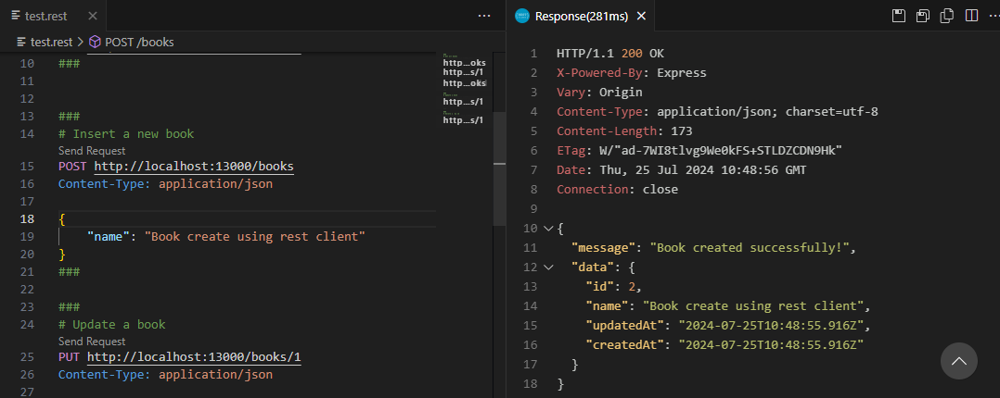
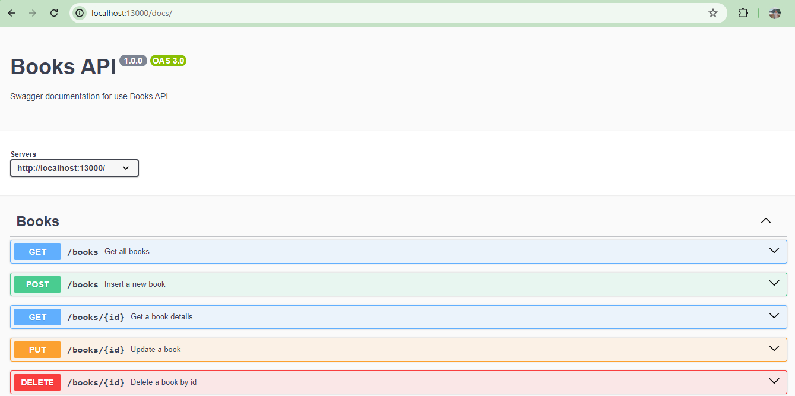
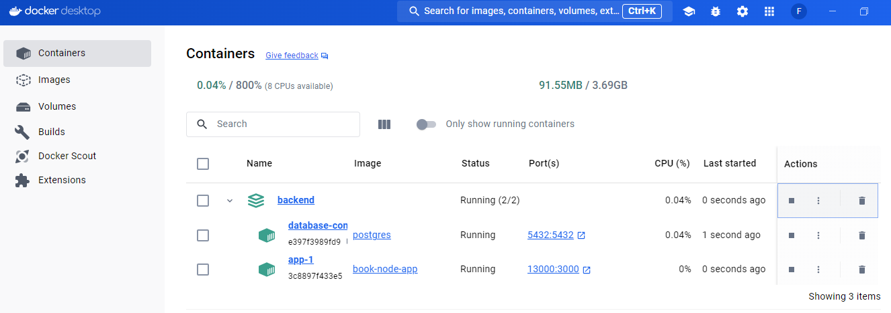
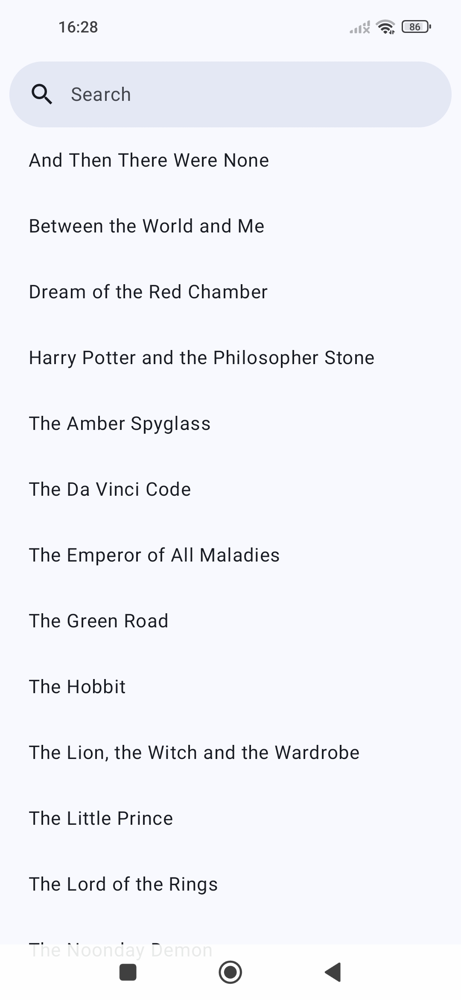
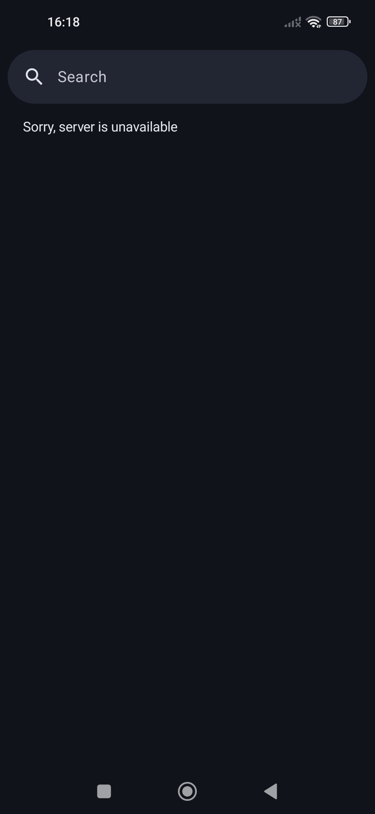
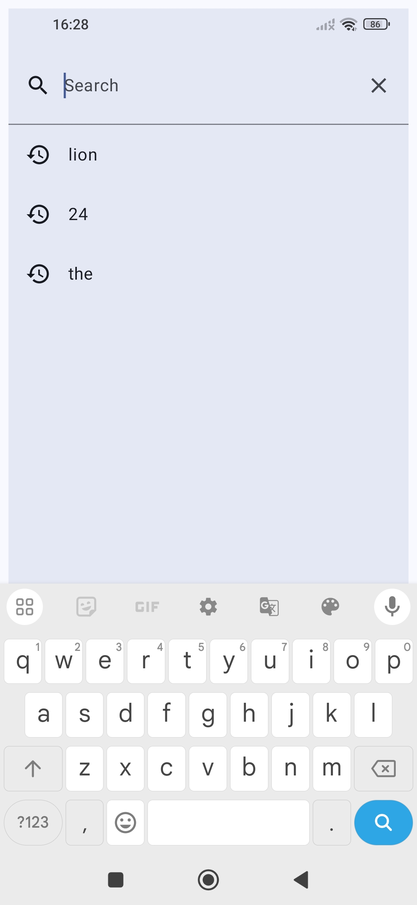

# Repository Details / Requirements:

Create a mobile app and a containerized application with two services (backend, database) as follows:

The solution should start after cloning the repo and giving the docker-compose up command.
The mobile app should be able to fetch data from the backend.
Stopping the backend solution with Ctrl+C or docker-compose down should gracefully stop the services, and the mobile app should display that the backend is not available anymore.
Provide instructions on how to run the mobile app.


## Backend Service:
- Is developed using Node.js, express and sequelize.
- Contains 5 endpoints that could be tested using Swagger or a REST client (.rest file)
* Get the list of books - gets the books from the database
* Get one book by id - gets one book with the matching id from the db
* Update one book by id - updates the title of the book by the given id
* Create a new book - inserts a new book into the db
* Delete a book by id - removes the book from the db

- Swagger endpoint: http://localhost:13000/docs

## Database:
- Database used is Postgres
- The database has one table listing books. The books have two columns/properties: an id and a title. When starting the solution, the database already have a few entries (seed.js).

### How to run backend service
- You need a docker installed
- After cloning the project, go to backend folder and run:
- - docker compose up -d


## Mobile App (Android)
- Using Jetpack Compose
- Create an emulator or connect a device using the same computer network
- Open the mobile/app folder in Android Studio and click to run the project 
- Or use a command line to build and install app:
- - gradlew installDebug
- - adb install path/to/your_app.apk
- **Note**: use ifconfig or ipconfig to get the correct ip address of your computer and update it in the **app/src/main/java/com/example/books/data/RetrofitClient.kt** file

```kotlin
Retrofit.Builder()
    .baseUrl("http://192.168.1.78:13000/")
```

### Screenshots Backend
<table width="100%">
    <tr>
        <td width="50%"></td>
        <td width="50%"></td>
    </tr>
    <tr>
        <td width="100%"></td>
    </tr>
</table>

### Screenshots Mobile / Android
<table width="100%">
    <tr>
        <td width="33%"></td>
        <td width="33%"></td>
        <td width="33%"></td>
    </tr>
</table>

### TODOs
- **Backend**
- - Migrate backend node.js to Typescrypt
- - Add JWT Authentication
- **Mobile**
- - Use strings to internationalize messages
- - Save search books in a local database (datastore, shared preferences)
- - Migrating Retrofit to Ktor to use KMM and test iOS version 

#### Migrating nodejs to typescript
- npm install -D typescript @types/node @types/express
- npx tsc -v (check if installed)
- npm install -D typescript @tsconfig/node22
- npm install --save-dev ts-node typescript
